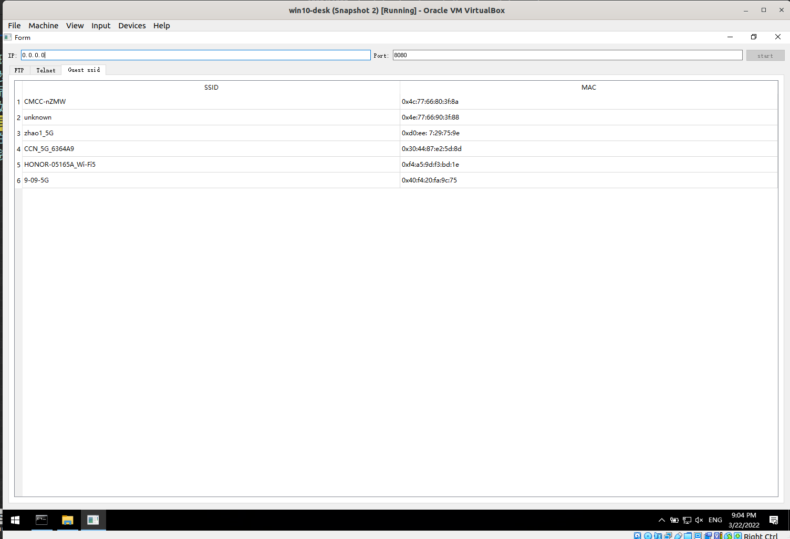

#  路由器内核后门实验

## 实验要求:

* [x] 在openwrt上安装软件，开通ssh，AP服务等；
* [x] 在openwrt上安装auditord，配置相关文件，抓取ftp、telnet和无线网卡wifi信号嗅探的内容，发送到外置服务器，并接收。
* [x] 在openwrt上安装privoxy，完成配置文件，实现对http协议的js代码注入功能。


## 实验环境

* [PHICOMM K2 PSG1218 rev. A](https://openwrt.org/toh/hwdata/phicomm/phicomm_k2_psg1218) (已刷Breed) 。因为所查到的[斐讯K2刷不死breed与第三方固件教程](https://www.cnblogs.com/pejsidney/p/12361234.html)都是面向windows操作系统的刷机方法,由于刷这个固件的软件来路不明,所以买的时候索性让老板先刷好breed控制台：
    
* 一个linux操作系统:Ubuntu 20.04.4 LTS
* openwrt固件选择:
    根据官网:
    >* Firmware OpenWrt Install / Upgrade URL :!: comes with GUI / LuCI pre-installed, ready to go. 意识就是Install / Upgrade版有GUI/LuCI.
    >* Firmware OpenWrt snapshot Install / Upgrade URL  :!: No GUI / LuCI pre-installed; LuCI needs to be installed manually ! 意思就是snapshot版没有GUI/LuCI。

    所以就选了`openwrt-21.02.2-ramips-mt7620-phicomm_psg1218a-squashfs-sysupgrade.bin`

* 一根网线连接路由器和电脑。


## 实验步骤：

### 1.1 先刷openwrt固件

**a. 刷之前先做好备份：**
    "EEPROM和编程器固件"都需备份:
    

**b.下面先将其恢复为出厂设置，固件类型选择“Config区（公版），然后执行** 
    

**c.装载固件，如下图所示，上传成功后，路由器会自动重启。**
    


* 刷完之后：
    

并且是可以用ssh登录的。

然后开始搭建网络。

**d.更改LAN IP使得其与主路由器为不同网段**

改这个主要是使得所买的路由器可以连上主路由器，免得ip地址冲突。

依次进入`Network -> Interface -> Lan项点击Edit`: 改成和主路由器不同的网段就行了：


**e.路由器无线接入**

因为主路由器在客厅，和实验的房间隔了一堵墙。现在既想让路由器放大客厅的wifi信号又想分出一个独立的网域，所以选择无线路由中继连接路由器。

* 通过网线连接无线路由器的LAN口，进入路由器后台，进入Network->Wireless页面，对原有的无线网络点击停用。

然后点击搜索，搜索主路由器的wifi信号,加入主路由器的网络，使得副路由器可以上网。


。输入所连接wifi的密码,默认配置，新的接口名称我起的为CMCC。


然后下一步，都是默认配置，都已经自动帮你填好了。

确认之后保存提交。

电脑直接和路由器网线连接，这样配置电脑所分配到的网段是`192.168.142.0/24`。


2.4G频段信号放大和上面一样操作。后面有几张搭建的网络拓扑图。

### 1.2 开始编译程序:

本来想像其他linux操作系统一样一键安装编译环境:但`opkg install build-essential`执行失败，没有build-essential。

原来：
> Openwrt was never meant to have build-essentials like package, you will probably have to build EasyCwmp using the SDK.

解决办法：**交叉编译**

交叉编译环境下载官方预编译好的sdk，也可以build root。这里下载的sdk。

**a.准备工作:**

* 一个linux操作系统环境用来交叉编译
* 宿主机安装官方文档[Prerequisites](https://openwrt.org/docs/guide-developer/toolchain/install-buildsystem)中一些依赖。
* 下载对应路由器架构的(SDK)(https://downloads.openwrt.org/releases/21.02.0/targets/)

下载并解压sdk：


**b.编译准备工作**

将所发的auditord文件下载解压，并放到sdk目录下的package的目录下：

```bash
z1933@1933:~/workplace/warehouse/softwaresecurity/openwrt/openwrt-sdk-21.02.2-ramips-mt7620_gcc-8.4.0_musl.Linux-x86_64 # sdk 目录
$ ls -la package/ # package 目录下的文件
total 36
drwxr-xr-x  7 z1933 z1933 4096 3月  21 23:16 .
drwxr-xr-x 13 z1933 z1933 4096 3月  22 13:32 ..
drwxrwxr-x  4 z1933 z1933 4096 3月  21 22:58 auditord
drwxrwxr-x  3 z1933 z1933 4096 3月  21 22:53 feeds
drwxr-xr-x  3 z1933 z1933 4096 2月  17 04:29 kernel
-rw-r--r--  1 z1933 z1933 4192 2月  17 04:29 Makefile
drwxrwxr-x  2 z1933 z1933 4096 3月  21 23:15 sockettest
drwxr-xr-x  3 z1933 z1933 4096 2月  17 04:29 toolchain
```

**c.加载软件包信息**

这里加载的是所有包的信息,但只是一个包信息清单，需要下载，下载速度取决于网速。
```bash
./scripts/feeds update -a
```

**d.选择所需要的包**

在sdk的根目录下执行：
```bash
make menuconfig
```

一定要把默认中global building 里面的这几个排除，不然就是直接编译整个库了:


最后在主菜单`Utilities`中选上`auditord`


**c.开始编译：**

```bash
make package/auditord/compile V=99 # 输出详细日志
```

会提示缺少包而没有成功：


安装`libuci`:
```bash
$ ./scripts/feeds install libuci
```


再次尝试编译之前需要对源码做一些改动：

1. 把这个架构检查部分的代码注释掉:

因为源码都是系统调用，只要系统上有这个包，问题就不大。

接下来重新编译源码

**d.重新编译，并安装**


```bash
make package/auditord/compile V=99
```

* 编译结果：


ipk就是我们需要的,然后用scp把这个包传到路由器上去,执行：
```
opkg install auditord_1_mipsel_24kc.ipk
```

### 1.3 编译内核模块

需要编译并加载这里我所编写hello-kernel内核模块，auditord才能运行，不然运行会报错：


当然也可以在源码中将协议号改成0，也可以运行，但是缺点是没有ftp，telnet流量嗅探功能。

还有就是我在用sdk编译内核模块没有成功(一直内核模块没有显示)，然后我花了2，3个小时下载编译整个build root环境才编译成功，搭建方法这里不再赘述，过程和sdk差不多但要整个源码编译，具体可以参考openwrt官方文档。后面都是在build root 环境下进行的操作。

---

这个实验,过程中查了很多资料。大概涉及到的内容有：

1. openwrt交叉编译环境搭建。如何写,编译运行一个内核模块。如何编译普通软件包。
2. NetLink的内核与用户通讯机制,如何添加自定义协议,并进行通讯。
3. linux内核所提供的Netfilter框架的理解（可以用来实现死亡之ping）。
4. 如何让linux telnet服务器强制客户端使用linemode进行连接。


---

~~还好这个实验给的时间比较充裕。~~

**a.编译准备工作**

Makefile 我都已经写好了。

1. 将源码包解压并放到你编译环境下:`./package/kernel/`目录下:


1. 然后执行`make menuconfig`,按`\`在菜单中搜索出内核模块：


选择它,保存退出。

**b.编译:**

```bash
make package/kernel/hello-kernel/compile V=99
```

然后用scp将其拷贝到路由器上去。
```
scp ./build_dir/target-mipsel_24kc_musl/linux-ramips_mt7620/hello-kernel-1.0/hello-kernel.ko  root@192.168.142.1:~/workplace
```
**c.在路由器中加载内核模块**

```bash
insmod hello-kernel.ko
```

可以用`dmesg -c`命令查看内核模块的一些Debug信息：


看到上面这样，即加载成功。


**可能会遇到的问题(踩过的坑)**
1. 如果安装提示没有libstdcpp库，执行：
```
opkg install libstdcpp6
```


### 2.1 获取路由器所收到的wifi信息

**a.配置网络拓扑情况**

因为我的宿主机是linux操作系统,运行服务器程序,需要一个windows操作系统。这里开一个windows的虚拟机做为服务器接受客户端(路由器)所发来的auditord消息。

虚拟机网络选择桥接：

注意一定要桥接到和路由器一个网段的网卡上,不然不处于同一个网络。

**整个网络的拓扑结构：**


**b.在windows虚拟机上开启监听：**

填入以下，监听在8080端口,然后start:


**c.在路由器上audit配置文件中写入服务器所对应的ip地址与端口号**
```bash
root@OpenWrt:~/workplace# cat /etc/config/audit 
config bsac audit
	option serverip '192.168.142.159'
	option port '8080'
	option enabled '1'
```

然后：


**d.服务器所接受到的wifi信息的结果：**



因为监听在5G频段(wlan0)的网卡，只能搜到5Gwifi信号的信息,监听在2.4G网卡(wlan1)上会搜到更多wifi信号。

```bash
root@OpenWrt:~/workplace $ iwinfo wlan1 scan | awk '{if(match($0,"Address:") || match($0,"ESSID:")){ print substr($0,RSTART+RLENGTH)}}' | xargs -n2
1C:D2:BA:12:27:A1 CMCC-dMyN
66:6E:97:2A:8D:FA unknown
00:E0:20:1E:83:2F Wireless-N
48:7D:2E:35:20:8B cquliuxuan
EA:5A:D1:12:E6:FD iTV-izSR
E8:5A:D1:72:E6:FD ChinaNet-izSR
74:7D:24:64:79:B0 lyl
26:69:8E:40:E1:3C unknown
9C:7F:81:65:7A:F1 CMCC-12-5
94:E0:D6:1D:B8:C5 CCN009528_2.4G
F4:83:CD:F3:F6:3C lxw0405
9E:7F:81:45:7A:F1 unknown
EC:41:18:D8:0E:F5 yangjuan
FC:37:2B:F1:9D:21 ChinaNet-fqX3
C8:3A:35:11:76:60 XQP1
30:44:87:E2:5D:8A CCN_13005
C8:3A:35:74:D6:78 Tenda_11-8
76:38:B7:79:44:D4 DIRECT-Z3D4-TS5300series
14:75:90:47:16:DC unknown
D4:EE:07:29:75:9E unknown
74:7D:24:56:FE:1C @PHICOMM_1A
30:44:87:E4:4A:92 CCN_6-2
34:2E:B6:22:6A:19 unknown
94:E9:EE:F7:1B:44 HUAWEI
74:FF:4C:1B:9E:DC CCN-1B9EDC
4C:77:66:80:3F:88 CMCC-uLVN
4E:77:66:40:3F:88 unknown
```

### 2.2 抓取ftp

这里用家里的旧电脑搭建了一个FTP服务器。搭建FTP服务器过程这里就不赘述了。


**实验过程中用dmesg命令可以看到内核模块的调试信息。**

**a.所搭建环境的网络拓扑:**


如图中所看到的,在家里旧电脑上搭建ftp服务器，设置用户名`ftpuser`密码：`ftp`。

auditord服务器用的windows虚拟机+桥接网卡搭建。

**b.运行auditord程序,在操作笔记本上连接ftp服务器**

ssh连接路由器之后执行：
```bash
auditord
```

然后自己登录到ftp服务器上随意输入一些命令。流量一定要 **流过** 路由器才行。

* 过程中auditord输出：


* 内核的日志调试信息：

用dmesg命令查看:


* auditord服务器所抓取到的情况：


抓取到用户名，密码，输入的命令。

### 2.3 Telnet流量嗅探

注意: 

* 流量一定要 **流过** 路由器才行。
* 内核的工作模式只支持linemode模式下的通讯。telnet linemode模式详情可以参考`man TELNET(1)`。

**a.网络拓扑搭建**

家里旧电脑是windows7系统，所搭建的telnet服务器不支持linemode模式。

这里借了一下室友的云服务器用了一下，临时搭建了一个支持linemode模式的telnet服务器。


服务器有公网ip。

**b.运行auditord程序,在操作笔记本上连接telnet服务器**

* 过程中auditord输出：


* 内核日志demsg输出：


* auditord服务器所抓取到的情况：


可以把auditrod和dmesg的输出对照着看，发现是可以对应上的。

### 3. http html js注入 

这里用未加密的这个(http://www.265.com/) http站点测试。
**a.安装privoxy包**

```bash
opkg update && opkg install privoxy
```

**b.编辑文件**

* 编辑`/etc/config/privoxy`文件,下面是改动的地方:

左边是改之后的文件，右边是原始文件。差不多就是把地址改成自己的地址。

* 在文件`/etc/privoxy/user.action`中加入：
```
{+filter{block-weeds}}                                             
.*
```

* 在文件`user.filter`中加入:
```
FILTER: block-weeds                      
s|</head>|<script> window.alert("You have been hacked!");</script>$0|
```

然后添加iptables规则：
```
iptables -t nat -A PREROUTING -s 0.0.0.0/0.0.0.0 -p tcp --dport 80 -j REDIRECT --to-ports 8118
```

**c.测试结果**

访问http://www.265.com/ :

成功执行js：


在审查源代码时可以看到嵌入的js：


## 遇到的问题：


1. 编译auditord是提示缺少包,报错目标架构: 
    
    参见实验过程中的解决办法

2. 消息接受服务器没有收到消息。
    一个坑点,之前路由器只配了一个网卡。,宿主机，windows虚拟机，路由器处于同一个网段上。我在宿主机上用nmap扫windows虚拟机上开放的端口是有结果的,但是收不到所发的wifi信号信息：
    * 服务器上端口开放：
    
    * nmap 扫描服务器端口开放：
    
    看源码的时候才发现是这行的原因：
    ```
    #define aut_scan_wifi_cmd                   "iwinfo wlan0 scan | awk '{if(match($0,\"address:\") || match($0,\"essid:\")){ print substr($0,rstart+rlength)}}' | xargs -n2"
    ```
    我的路由器网卡上的是wlan1，这里是waln0，肯定不对，要把这个硬编码改成1。

3. 一样的代码，内核模块在宿主机,虚拟机上都抓不到任何tcp包中的数据。还好在路由器上有数据,这个实验才能进行下去。提了一个问也没有人回答：[stackoverflow-Netfilter Kernel module doesn't get the ftp packets' data](https://stackoverflow.com/questions/71633805/netfilter-kernel-module-doesnt-get-the-ftp-packets-data)

    这个问题困扰我很长时间。希望有后来的大佬能够回答一下。

## 内核模块实现思路:

最后说一下内核模块编写的大概思路。

**a.ftp流量嗅探:**

1. 如何识别ftp流量？ 

先判断是不是tcp包。然后再判断包发往的端口(21)。ip报文头部有数据包总长度信息，tcp报文头部有报头长度信息，减一下就知道payload的长度了。

2. 如何跟踪用户,记录用户的操作?

用户输入用户名之后,用抓包器抓包,观察可以发现ftp包的内容里面有USER字段。密码中有PASS字段。每当在tcp payload中匹配到了USER字段就记录这个包的tcp端口号，源ip地址,更新ftp用户名,(这样可以做到幂等性原则)。当匹配到了PASS字段要与所记录的tcp端口号，源ip地址做相等判断,只有相等时才记录密码(也就是说一次只会跟踪一名用户)。之后每当遇到的源ip地址和源端口相等时都把命令直接记录下来。

差不多就这些,代码中写了很多注释。

**b.telnet流量嗅探**

1. 如何识别telnet的开始？

只判断tcp端口是不够的。跟ftp还有点不一样。telnet数据中没有ftp那些规范的前缀(PASS,USER等),因为telnet在连接之前服务器与客户端需要协商一些设置(比如终端大小,是否开启Echo等),需要判断用户啥时候开始输入。

用payload长度,tcp端口(23)判断出是否是telnet数据包,然后payload开头如果是`0xff`就说明是协商阶段的包，把它丢弃,第一个开头不是`0xff`的包就是用户名，接下来一个的就是密码。

## 一些总结：


最后，总的来说写出第一版，也就是现在这个版本的“山寨“内核模块有的地方还不够完美，还可以优化，主要是算法实现以及代码可读性上的改进，还有一些异常情况需要处理等。有时间有需求的话可以基于这个进行二次开发。

## 参考资料

* [斐讯 K2 刷机](https://l-qq.github.io/myBlog/2019/12/02/%E6%96%90%E8%AE%AF-K2-%E5%88%B7%E6%9C%BA/)
* [Getting Started with OpenWrt C Programing](https://electrosome.com/cross-compile-openwrt-c-program/)
* [Techdata: PHICOMM K2 PSG1218 rev. A](https://openwrt.org/toh/hwdata/phicomm/phicomm_k2_psg1218)
* [斐讯K2刷不死breed与第三方固件教程- J'KYO - 博客园](https://www.cnblogs.com/pejsidney/p/12361234.html)
* [在PHICOMM K2路由器中装入OpenWrt操作系统](https://blog.csdn.net/qingwufeiyang12346/article/details/88753985)
* [OpenWrt设置路由器联网（无线）](https://zhuanlan.zhihu.com/p/342887364)
* [Getting Started with OpenWrt C Programing](https://electrosome.com/cross-compile-openwrt-c-program/)
* [OpenWrt 编译步骤与命令详解教程](https://p3terx.com/archives/openwrt-compilation-steps-and-commands.html)
* [OpenWrt Cross compiling](https://openwrt.org/docs/guide-developer/toolchain/crosscompile)
* [Writing and Compiling A Simple Program For OpenWrt](https://www.gargoyle-router.com/old-openwrt-coding.html#part1)
* [Using the SDK Openwrt Wiki](https://openwrt.org/docs/guide-developer/toolchain/using_the_sdk)
* [netlink(7) — Linux manual page](https://man7.org/linux/man-pages/man7/netlink.7.html)
* [OpenWrt路由器无线中继、桥接、信号放大、访客网络的实现方案](https://blog.csdn.net/lvshaorong/article/details/53230545#t2)
* [Windows10 下搭建 FTP 服务器](https://www.jianshu.com/p/ece21421e246)
* [Privoxy - Home Page](https://www.privoxy.org/user-manual/quickstart.html)
* [Kernel Korner - Why and How to Use Netlink Socket](https://www.linuxjournal.com/article/7356)
* [Hacking the Linux Kernel Network Stack](http://phrack.org/issues/61/13.html)
* 老师发的课件
* [Examples of TELNET negotiation](https://www.omnisecu.com/tcpip/telnet-negotiation.php)
* [What's the difference between the telnetd and inetutils-telnetd packages in Ubuntu?](https://unix.stackexchange.com/questions/629819/whats-the-difference-between-the-telnetd-and-inetutils-telnetd-packages-in-ubun)
* [Printing sk_buff data](https://olegkutkov.me/2019/10/17/printing-sk_buff-data/)
* [[译] 深入理解 iptables 和 netfilter 架构](https://arthurchiao.art/blog/deep-dive-into-iptables-and-netfilter-arch-zh/#2-netfilter-hooks)
* [科软-信息安全实验2-netfilter实验 ](https://www.cnblogs.com/southday/p/11006936.html)
* [内核模块开发](https://linux.fasionchan.com/zh_CN/latest/system-programming/kernel-programming/module-development.html)
* [Kernel Korner - Why and How to Use Netlink Socket](https://www.linuxjournal.com/article/7356)
* [Linux netlink之添加一个简单协议](https://www.cnblogs.com/bbsno1/p/3279761.html)
